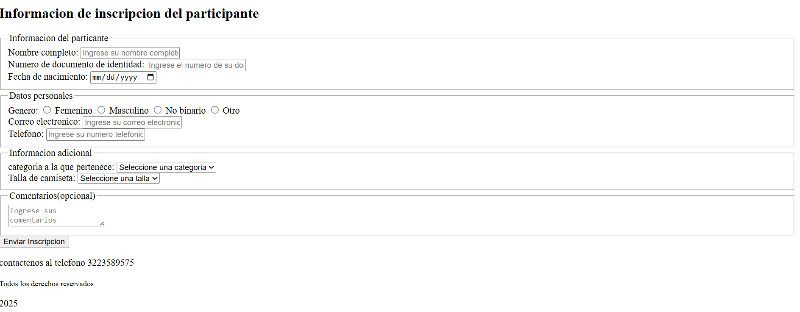

# 🏃Registration for athletics competition

Webside where people can register for an athletics competition in Bucaramanga

## About 

## 📄Project description

```
This a project is a form that displays information about the competition and collect the
required information for a person to register.
```
## 🛠️ Utility
```
The webside alows people who want to participate in the competition to register and take
part.It also helps the Bucaramanga City Hall,which is organizing  the event for the
fiftieth time, to promote and keep the competition organized.
```
## 🧰 Technologies used

- **HTML**   
- **Visual Studio Code** (for development) 


#### 💡 Example of Use

Enter all fiels as they are required, except of comments which are opcional.

### 🚀 How to Run
1.Clone the repository:

git clone https://https://github.com/CamilaFlorez12/Taller-HTML

2.Open the file in the web browser


## Authors ✒️

_Camila Florez_

* **Camila Florez** -

## 🔗 Repository
This project is available under the following repository:
https://https://github.com/CamilaFlorez12/Taller-HTML
